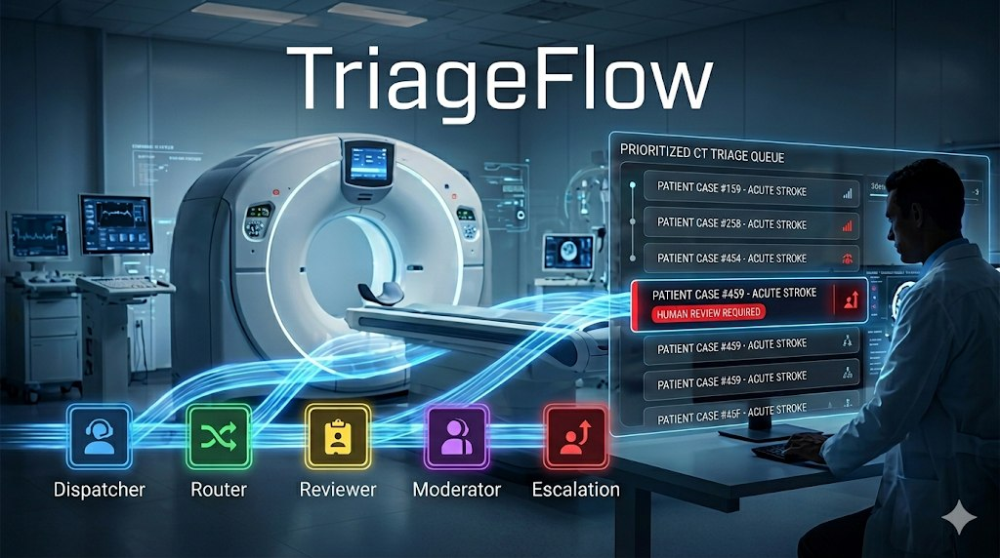

# TriageFlow — Agentic Queue Prioritization



A research prototype demonstrating how agentic AI workflows can intelligently prioritize medical imaging queues while maintaining human oversight. TriageFlow shows that autonomous agents can make nuanced clinical and operational decisions, but only when they operate within a human-centered feedback loop.

## The Problem

Hospital radiology departments face a daily challenge: which patient should get the next CT scan? The answer isn't simple. It depends on:

- **Clinical urgency** — A stroke patient needs imaging differently than someone with chronic back pain
- **Waiting time** — How long has each patient been waiting?
- **Operational context** — How many cases are ahead? What's the scanner throughput?
- **Confidence gaps** — When is the AI uncertain enough to escalate to a clinician?

Current FIFO (first-in-first-out) queuing often delays critical cases while non-urgent patients wait. Manual re-prioritization by radiologists is cognitively expensive and inconsistent. And purely algorithmic approaches that ignore context or clinician input risk patient safety.

**TriageFlow explores a middle path:** Let AI agents reason about urgency and placement, but require human approval for escalated cases and feed clinical feedback back into the AI for continuous learning.

## Why Agentic AI?

Traditional software can't reason flexibly about clinical context. LLMs are powerful but stateless—they're one-shot classifiers without the ability to:

- Compare cases pairwise against current queue context
- Maintain decision history and explain their reasoning
- Gracefully escalate when confidence is low
- Learn from clinician feedback

TriageFlow uses **LangGraph agents** coordinated via **Band messaging** to create a multi-agent workflow where:

1. **Review Agent** evaluates each case's clinical urgency independently
2. **Moderator Agent** makes placement decisions using binary-search pairwise comparison (does case A deserve to jump ahead of case B? What if we compare B and C?)
3. **Escalation Agent** routes uncertain cases to human review
4. Clinicians provide feedback, which feeds back into future agent decisions

This architecture mirrors how human triage actually works—multiple perspectives, comparison, and escalation when uncertain.

## What Makes This Proof-of-Concept

This is **not** a production system. It's a research prototype designed to:

- ✅ Demonstrate that agents can coordinate complex decisions via message passing
- ✅ Show how to maintain an auditable decision log (every agent decision is logged)
- ✅ Prove that human-in-the-loop escalation works operationally
- ✅ Explore what happens when agents get feedback ("clinician said this needed re-review—what did we miss?")

It intentionally uses a **simulated queue** so we can test scenarios, replay decisions, and understand failure modes without patient risk.

## The Architecture

```
Clinical Data + Context
        ↓
    Band Room (per case)
        ↓
┌────────────────────────────────────┐
│ Review Agent                       │
│ "How urgent is this case?"         │
│ Outputs: urgency score + reasoning │
└────────┬─────────────────────────┘
         ↓
┌────────────────────────────────────┐
│ Moderator Agent                    │
│ "Where should it go in queue?"     │
│ Inputs: this case + queue context  │
│ Outputs: placement + confidence    │
└────────┬─────────────────────────┘
         ↓
    ┌────────────────────────┐
    │ Confidence > threshold?│
    └┬──────────────────────┬┘
   YES                      NO
     ↓                      ↓
  Place in queue      Escalation Agent
                    "Send to clinician"
                    (Waits for decision)
```

Each decision is logged with full reasoning. Clinician feedback loops back, enriching future decisions.

## Key Innovation: Pairwise Comparison Under Context

Unlike threshold-based scoring, the moderator agent uses **binary-search placement**:

> "Case A is a suspected stroke (score 9). Case B is a trauma (score 8). But case B arrived 2 hours ago and is in position 3—does A deserve to jump ahead?"

The agent reasons about both the clinical facts AND the operational cost of reordering. This reduces false urgency escalations and improves clinician trust.

## What We're Learning

1. **Agents need opacity for trust** — Clinicians won't accept a black-box queue. Every placement must have explainable reasoning.
2. **Escalation is a feature, not a failure** — When an agent says "I'm 60% confident," that's valuable. It triggers human review.
3. **Feedback improves agents** — When a clinician returns a case with notes ("needs re-review—missed something"), agents see it on next processing.
4. **Simulation is critical** — Testing in a simulated queue lets us run 1000 cases in seconds and understand edge cases.

## Getting Started

For detailed setup and testing instructions, see:

- **[STARTUP.md](STARTUP.md)** — Full initialization and running the system
- **[agents/README.md](agents/README.md)** — Agent architecture and message contracts
- **[frontend/README.md](frontend/README.md)** — Dashboard and UI details

Quick overview:

```bash
# 1. Initialize
python3 scripts/create_db.py && python3 -m storage.seed_cases

# 2. Start backend
python3 -m agents.run_router &
python3 -m agents.run_review &
python3 -m agents.run_moderator &
python3 -m agents.run_escalation &
python3 -m api &

# 3. Start frontend
cd frontend && PYTHON_API_BASE_URL=http://127.0.0.1:8000 npm run dev
```

Then open the dashboard and run a simulation to see the agents in action.

## Project Structure

```
.
├── agents/            # LangGraph agents + Band coordination
├── api/               # FastAPI HTTP server
├── frontend/          # React dashboard
├── storage/           # SQLite schema + seed data
├── scripts/           # Simulation and testing utilities
└── agent_config.yaml  # Agent tuning parameters
```


